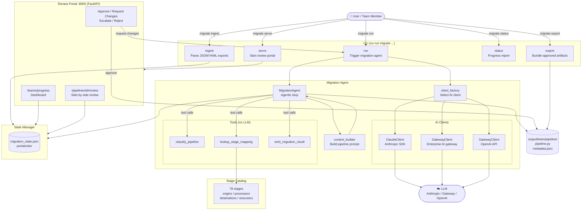
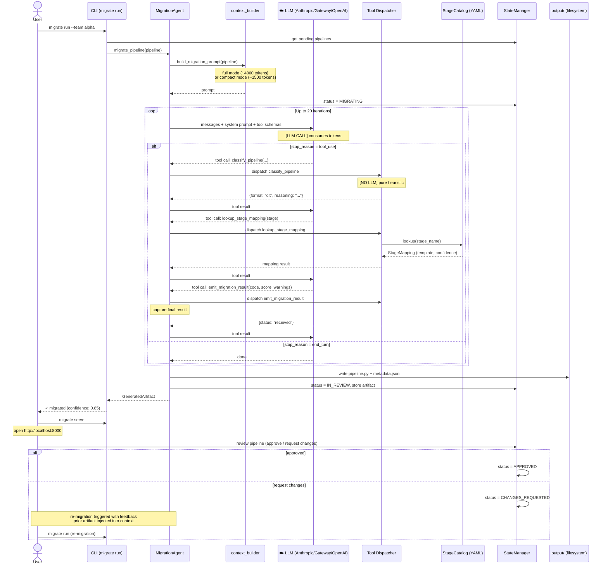

# StreamSets → Databricks Migration Agent

AI-powered agent to migrate StreamSets Data Collector pipelines to Databricks (Delta Live Tables, Jobs, or Notebooks) — with a human-in-the-loop review portal.

Built for scale: 2000 pipelines, 20 teams, 78 unique stages.

---

## How It Works

```
1. Ingest   → Parse StreamSets JSON/YAML exports, register in state
2. Migrate  → AI agent converts each pipeline to Databricks Python code
3. Review   → Humans approve, request changes, or escalate via web portal
4. Export   → Bundle approved artifacts for deployment
```

The agent auto-selects the best Databricks target per pipeline:
- **Delta Live Tables (DLT)** — streaming pipelines (Multi-topic Kafka, Azure Event Hubs)
- **Databricks Job** — batch/cron pipelines
- **Notebook** — complex pipelines with custom code (Groovy/Jython) or many stages

---

## Call Flow Diagrams

### System Overview



---

### Agentic Loop (per pipeline)



---

## Quickstart

### Prerequisites
- Python 3.11+
- [uv](https://docs.astral.sh/uv/) package manager — install with `pip install uv` or see [uv docs](https://docs.astral.sh/uv/getting-started/installation/)
- An API key for one of: Anthropic, OpenAI, or your enterprise AI gateway

### Setup

```bash
git clone git@github.com:heravelli/streamsets-databricks-migration-agent.git
cd streamsets-databricks-migration-agent

# Create and activate a virtual environment
uv venv
source .venv/bin/activate        # macOS / Linux
# .venv\Scripts\activate         # Windows

# Install dependencies into the venv
uv sync

# Configure credentials
cp .env.example .env
# Edit .env — choose one of the three client options (anthropic / openai / gateway)
```

### Run

```bash
# 1. Place your StreamSets pipeline exports in data/pipelines/<team_name>/
mkdir -p data/pipelines/my_team
cp /path/to/exports/*.json data/pipelines/my_team/

# 2. Ingest pipelines (team name inferred from directory name)
uv run migrate ingest data/pipelines/my_team/

# 3. Run the migration agent
uv run migrate run --team my_team --concurrency 3

# 4. Start the review portal
uv run migrate serve

# 5. Open http://localhost:8000 in your browser to review and approve
```

---

## CLI Reference

| Command | Description |
|---|---|
| `migrate ingest <dir>` | Parse exports — team name inferred from directory name |
| `migrate ingest <dir> --team <name>` | Parse exports with explicit team name override |
| `migrate ingest <dir> --dry-run` | Parse only, don't write state |
| `migrate run --team <name>` | Run agent on all pending pipelines for a team |
| `migrate run --pipeline-id <id>` | Run agent on a single pipeline |
| `migrate run --all --concurrency 10` | Run all 2000 pipelines in parallel |
| `migrate serve [--port 8080] [--reload]` | Start the human review portal |
| `migrate status` | Progress table for all teams |
| `migrate status --team <name>` | Per-pipeline status for one team |
| `migrate export <output_dir>` | Bundle approved artifacts |
| `migrate export <output_dir> --team <name> --format zip` | Team-scoped zip bundle |

---

## Configuration

All settings are environment variables (`.env` file or container env):

```env
# ── Anthropic (direct) ─────────────────────────────────────────────────
ANTHROPIC_API_KEY=sk-ant-...
ANTHROPIC_MODEL=claude-sonnet-4-6

# ── AI Gateway (alternative to direct Anthropic — see AI Gateway section)
AGENT_CLIENT_TYPE=gateway           # Set to "gateway" to use the gateway
AI_GATEWAY_URL=https://ai-gateway.internal/v1
AI_GATEWAY_TOKEN=your-token-here
AI_GATEWAY_MODEL=claude-sonnet      # Model name as exposed by the gateway

# ── Paths (override for Docker/AKS) ────────────────────────────────────
DATA_DIR=data/pipelines
OUTPUT_DIR=output
STATE_FILE=data/state/migration_state.json

# ── Agent tuning ────────────────────────────────────────────────────────
AGENT_MAX_TOKENS=8096
AGENT_CONCURRENCY=3                 # Parallel pipeline migrations
AGENT_COMPACT_CONTEXT=false         # Set true for token-limited gateway models
```

---

## AI Gateway

If your organisation routes AI traffic through a central gateway (LiteLLM, Azure AI Gateway, Apigee, etc.), use the gateway client instead of calling Anthropic directly.

Set these in `.env`:

```env
AGENT_CLIENT_TYPE=gateway
AI_GATEWAY_URL=https://ai-gateway.yourcompany.com/v1
AI_GATEWAY_TOKEN=<token-from-gateway-team>
AI_GATEWAY_MODEL=<model-name-as-exposed-by-gateway>
```

The gateway client speaks the **OpenAI-compatible** chat completions API (`POST /v1/chat/completions` with `tools`), which is the most common enterprise gateway standard. No code changes needed — the factory selects the right client based on `AGENT_CLIENT_TYPE`.

The direct Anthropic client (`AGENT_CLIENT_TYPE=anthropic`, the default) is unchanged.

---

## Stage Catalog

Stage mappings live in `catalog/stages/` as YAML files:

```
catalog/stages/
├── origins.yaml       # Sources (Kafka, JDBC, S3, etc.)
├── processors.yaml    # Transformations (expressions, type converters, etc.)
├── destinations.yaml  # Sinks (Delta, JDBC, Kafka, S3, etc.)
└── executors.yaml     # Executors (shell, JDBC query, email, etc.)
```

All **78 production stages** are fully cataloged (see `streamsets_stages.md` for the authoritative list). Each entry maps a StreamSets stage to its Databricks equivalent with a Jinja2 code template:

```yaml
- streamsets_stage: "com.streamsets.pipeline.stage.origin.multikafka.MultiKafkaDSource"
  streamsets_label: "Multi-Topic Kafka Consumer"
  databricks_equivalent: "dlt_streaming_table"
  confidence: "exact"             # exact | high | medium | low | unsupported
  code_template: |
    @dlt.table(name="{{ topic }}_raw")
    def {{ topic }}_raw():
        return spark.readStream.format("kafka")...
  config_mapping:
    conf.brokerURI: "bootstrap_servers"
    conf.topicList: "topic_list"
  requires_manual_review: false
```

To add a new stage discovered in production, add an entry to the appropriate YAML file and restart the agent. Stages with `confidence: "unsupported"` auto-route the pipeline to Notebook format.

---

## Human Review Portal

`uv run migrate serve` → http://localhost:8000

| Page | URL | Description |
|---|---|---|
| Dashboard | `/teams/progress` | All 20 teams — completion %, counts by status |
| Queue | `/pipelines/?team=X&status=in_review` | Reviewer's queue |
| Review | `/pipelines/{id}/review` | Side-by-side: original JSON + generated code |
| Diff | `/pipelines/{id}/diff` | What changed after a re-migration |

### Review decisions

- **Approve** → artifact written to `output/`, status = `approved`
- **Request Changes** → reviewer writes feedback → agent re-migrates in background → diff shown
- **Escalate** → routed to senior engineer queue
- **Reject** → marked rejected with reason

---

## Docker / AKS Deployment

### Local Docker

```bash
# Copy and fill in your credentials
cp .env.example .env

# Build and run
docker compose up --build

# Open http://localhost:8000
```

### Run CLI commands in Docker

```bash
# Ingest (one-off)
docker compose run --rm migration-agent uv run migrate ingest /data/pipelines/my_team/ --team my_team

# Run all migrations
docker compose run --rm migration-agent uv run migrate run --all --concurrency 5

# Check status
docker compose run --rm migration-agent uv run migrate status
```

### AKS (Kubernetes)

Mount a **PersistentVolumeClaim** at `/data` for state + output persistence.

```yaml
# Example PVC mount in your deployment
volumes:
  - name: migration-data
    persistentVolumeClaim:
      claimName: migration-pvc

volumeMounts:
  - name: migration-data
    mountPath: /data
```

Environment variables from a Kubernetes Secret:
```bash
kubectl create secret generic migration-secrets \
  --from-literal=ANTHROPIC_API_KEY=sk-ant-... \
  --from-literal=AI_GATEWAY_TOKEN=...
```

The review portal pod runs the FastAPI server. CLI migration commands (`migrate run`) run as **Kubernetes Jobs**.

---

## Project Structure

```
├── agent/
│   ├── claude_client.py        # Direct Anthropic SDK client
│   ├── gateway_client.py       # AI gateway client (OpenAI-compatible)
│   ├── client_factory.py       # Selects client based on AGENT_CLIENT_TYPE
│   ├── migration_agent.py      # Agentic loop (tool-use orchestrator)
│   ├── context_builder.py      # Builds per-pipeline Claude context
│   ├── tools/                  # classify_pipeline, lookup_stage_mapping, emit_result
│   └── prompts/system_prompt.md
├── catalog/stages/             # YAML stage mappings (origins/processors/destinations/executors)
├── cli/                        # Typer CLI commands
├── config/settings.py          # All config from env vars
├── models/                     # Pydantic models (streamsets, migration, stage_mapping)
├── parser/                     # Pipeline JSON/YAML parser + classifier
├── review/                     # FastAPI review portal + HTML templates
├── state/                      # File-based state manager (portalocker)
├── data/pipelines/             # Input: StreamSets exports (gitignored)
├── output/                     # Generated Databricks code (gitignored)
├── Dockerfile
└── docker-compose.yml
```

---

## Pipeline Status Lifecycle

```
pending → migrating → in_review → approved ✓
                              ↓
                     changes_requested → re_migrating → in_review
                              ↓
                          escalated
                              ↓
                           rejected
```

---

## License

Internal use.
